# Architecture Diagrams
## Visual Reference for React Migration

---

## System Architecture Overview

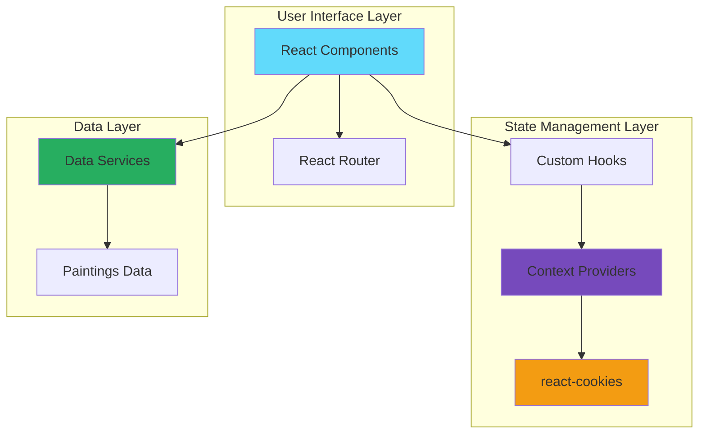

---

## Component Hierarchy

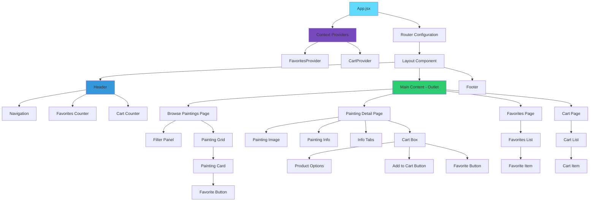

---

## Data Flow: Favorites System

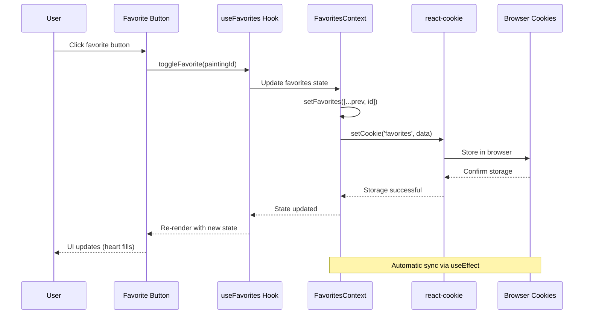

---

## Data Flow: Cart System

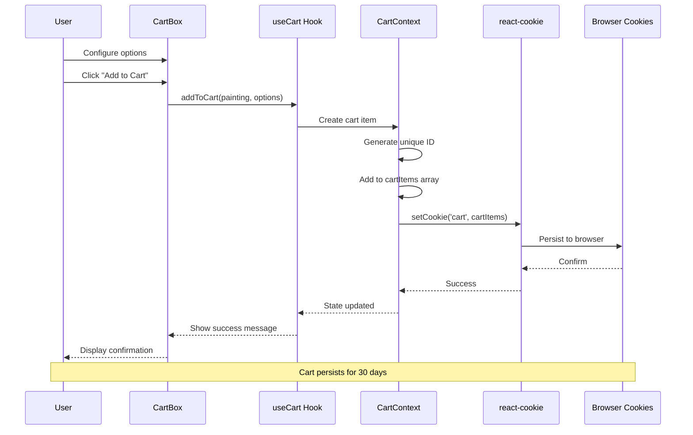

---

## State Initialization Flow

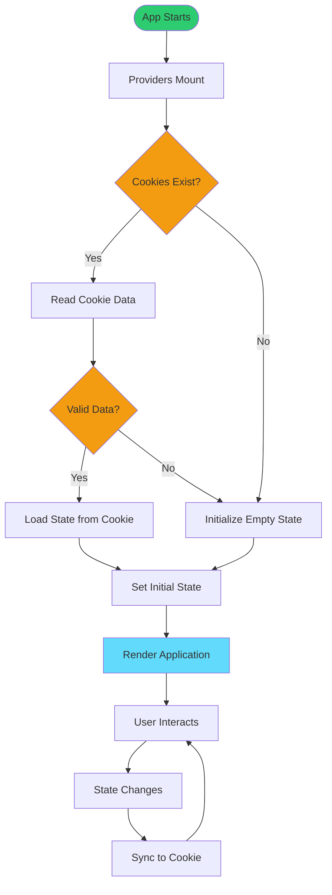

---

## Error Handling Flow

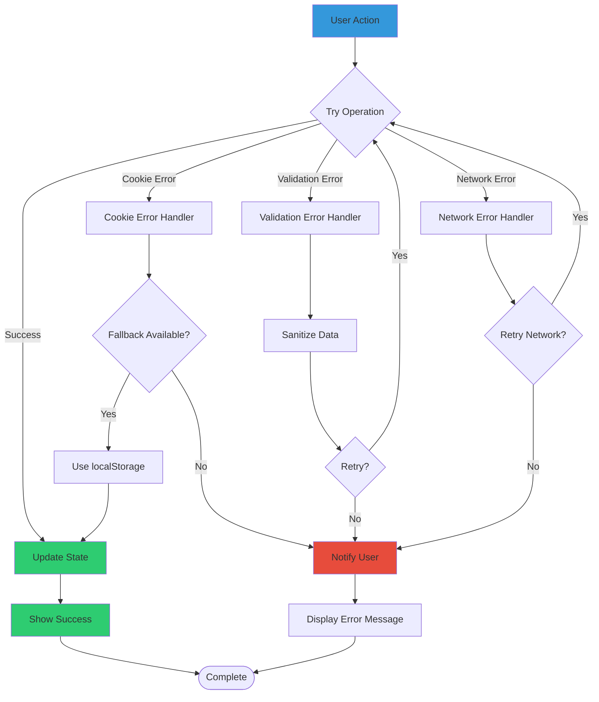

---

## Cookie Storage Strategy

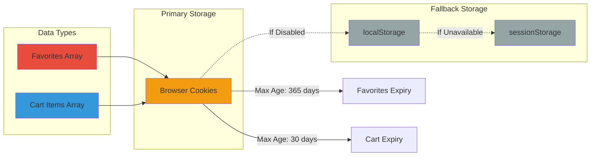

---

## Component Communication Patterns

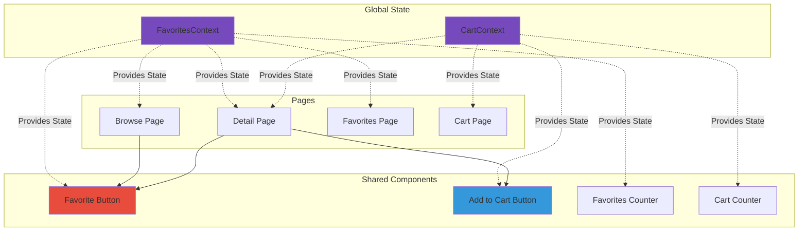

---

## Migration Phases Timeline

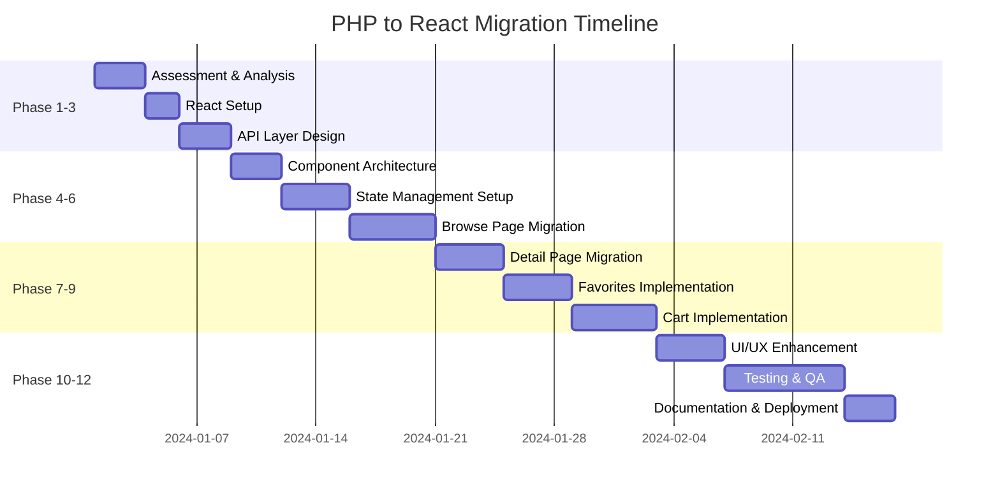

---

## Testing Strategy Pyramid

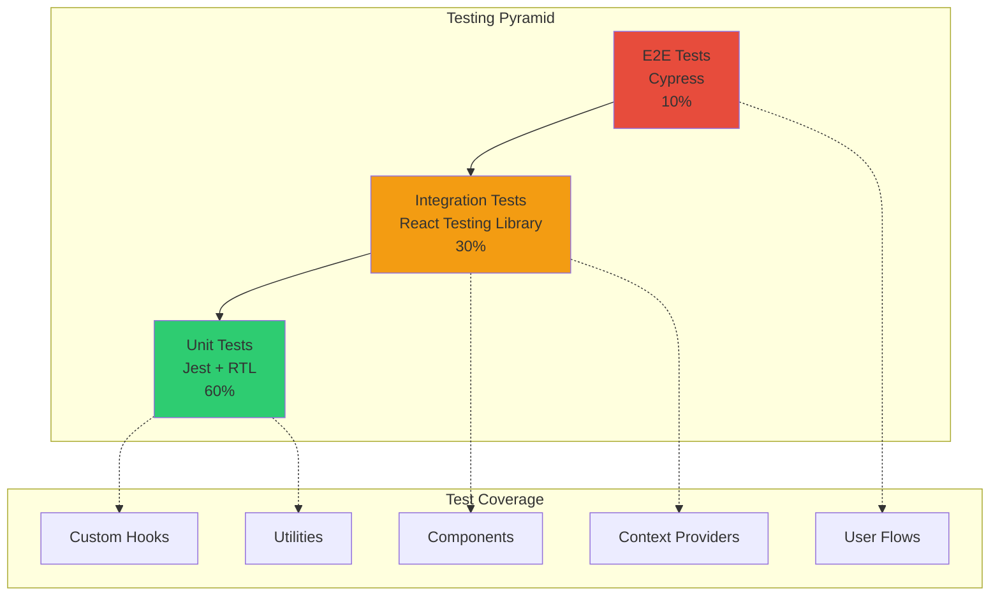

---

## Deployment Architecture

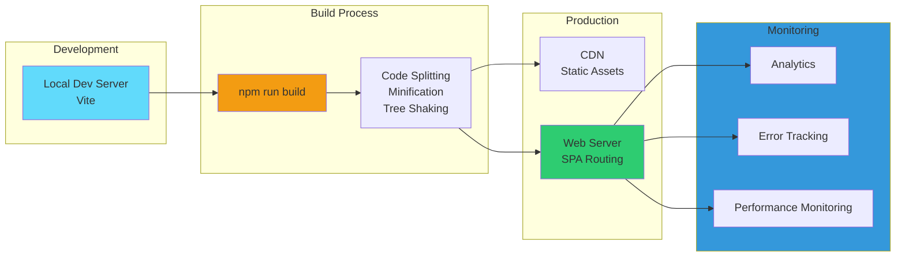

---

## Security Considerations

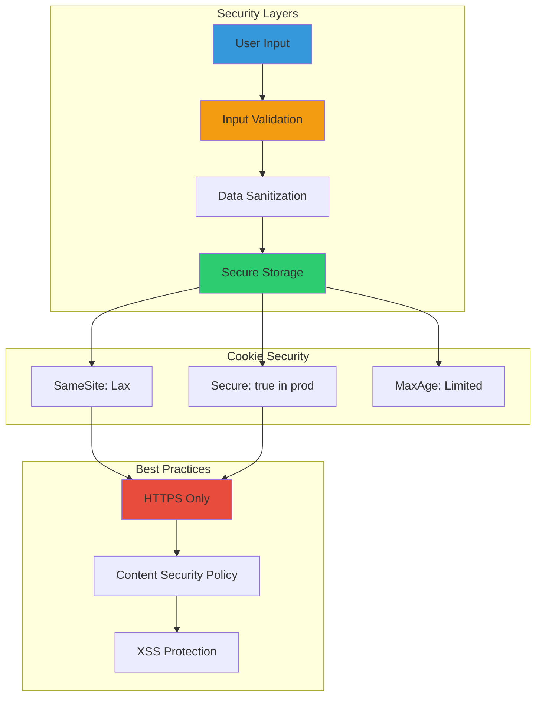

---

## Performance Optimization Strategy

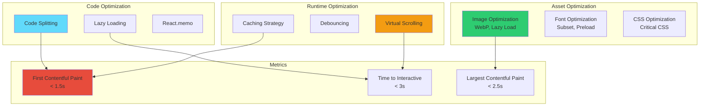

---

## Summary

These diagrams provide visual representations of:

1. **System Architecture** - Overall structure and layers
2. **Component Hierarchy** - How components are organized
3. **Data Flow** - How data moves through the application
4. **State Management** - Context and cookie integration
5. **Error Handling** - Graceful degradation strategies
6. **Testing Strategy** - Comprehensive test coverage
7. **Deployment** - Production architecture
8. **Security** - Protection mechanisms
9. **Performance** - Optimization strategies

Use these diagrams as reference during development and for team communication.